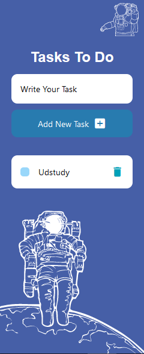

# Ustudy Final Project Task To-Do React Native

### Task To Do
    
  - [React Native App](https://github.com/x39OME/Ustudy-Application-Development-Camp/tree/main/Week%206/Final%20Project/TaskToDo)
    ```
      ● Create a React Native Application
    ```
## Steps
- npm install
- npm start
- npm start -w


